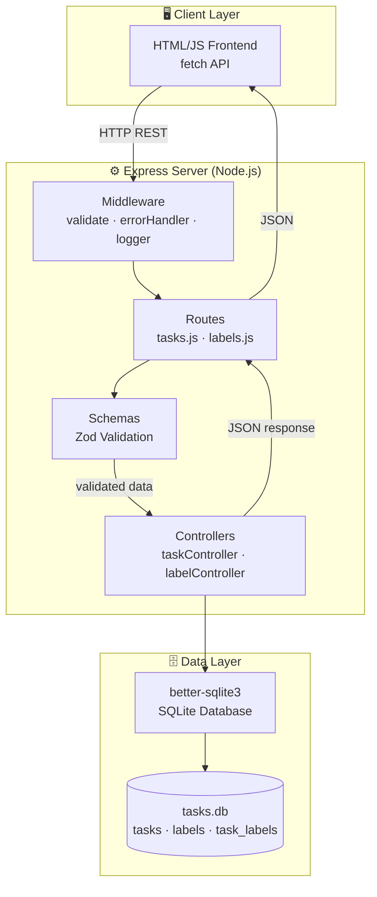
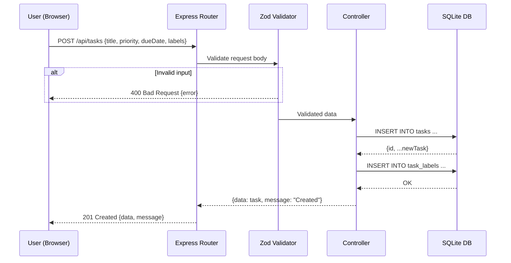
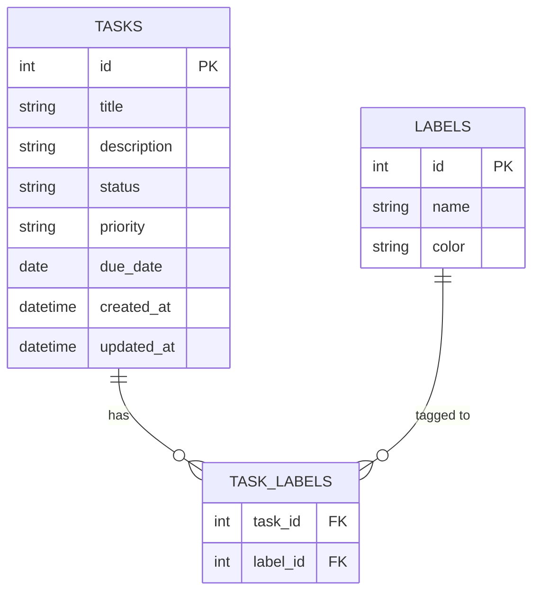
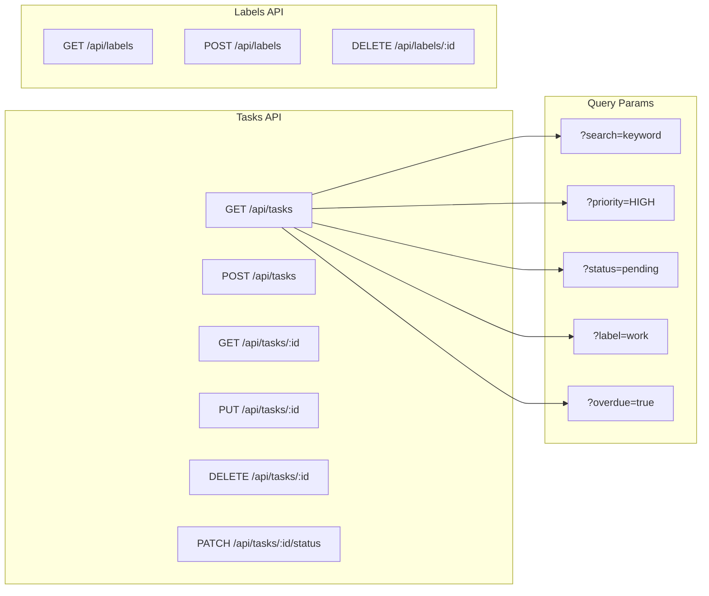

# ARCHITECTURE.md — Personal Task Tracker

## Системийн тойм

REST API + SQLite хадгалалт + minimal HTML frontend. Layered architecture ашиглана:
**Client → Routes → Controllers → DB**.

---

## 1. Давхаргын диаграм (Layer Diagram)



---

## 2. Өгөгдлийн урсгал (Data Flow)



---

## 3. Өгөгдлийн загвар (Entity Relationship)



---

## 4. API Endpoint бүтэц



---

## 5. Хавтасны бүтэц (Directory Structure)

```
partB/
├── src/
│   ├── server.js           # HTTP сервер эхлүүлэгч
│   ├── app.js              # Express тохиргоо, middleware
│   ├── db/
│   │   ├── database.js     # SQLite connection singleton
│   │   └── schema.sql      # Хүснэгт үүсгэх SQL
│   ├── routes/
│   │   ├── tasks.js        # /api/tasks бүх route
│   │   └── labels.js       # /api/labels бүх route
│   ├── controllers/
│   │   ├── taskController.js   # Task CRUD logic
│   │   └── labelController.js  # Label CRUD logic
│   ├── middleware/
│   │   ├── errorHandler.js # Global error handler
│   │   └── validate.js     # Zod validation wrapper
│   └── schemas/
│       └── taskSchema.js   # Zod schema тодорхойлолт
├── tests/
│   ├── tasks.test.js
│   └── labels.test.js
├── openapi.yaml
├── package.json
└── README.md
```

---

## 6. Модулийн тодорхойлолт

| Модуль | Үүрэг |
|---|---|
| `server.js` | Port-оос сонсох, graceful shutdown |
| `app.js` | Middleware бүртгэл, route mount |
| `db/database.js` | `better-sqlite3` connection, schema init |
| `routes/tasks.js` | Task endpoint-уудын Router |
| `routes/labels.js` | Label endpoint-уудын Router |
| `controllers/taskController.js` | Task бизнес логик (CRUD + filter + search) |
| `controllers/labelController.js` | Label бизнес логик |
| `middleware/errorHandler.js` | Express error handler (500, 404) |
| `middleware/validate.js` | Zod schema-аар req.body шалгах |
| `schemas/taskSchema.js` | Task/Label-ийн Zod schema |